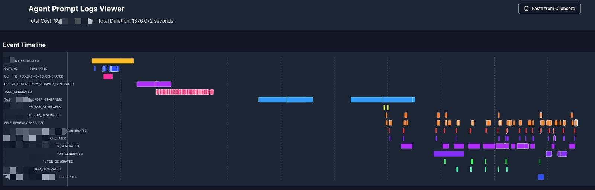

# n=1 Dev tools for Agent Logs

## Network Tab

## Logs Tab

For each user session, view, search, filter code/json/md prompt inputs/outputs.

We use YAML/JSON as output in lot of prompts, but editing them in IDEs/notebooks if the output has multiple lines or nested objects is a pain. So, asked Claude to make a simple editor for this.

Out of Scope: Copy to clipboard and convert to JSON/YAML, then stitch for few shots or finetuning dataset.

Dependencies: Vite, React, TypeScript, Shadcn.
Thanks/blame Claude :)
